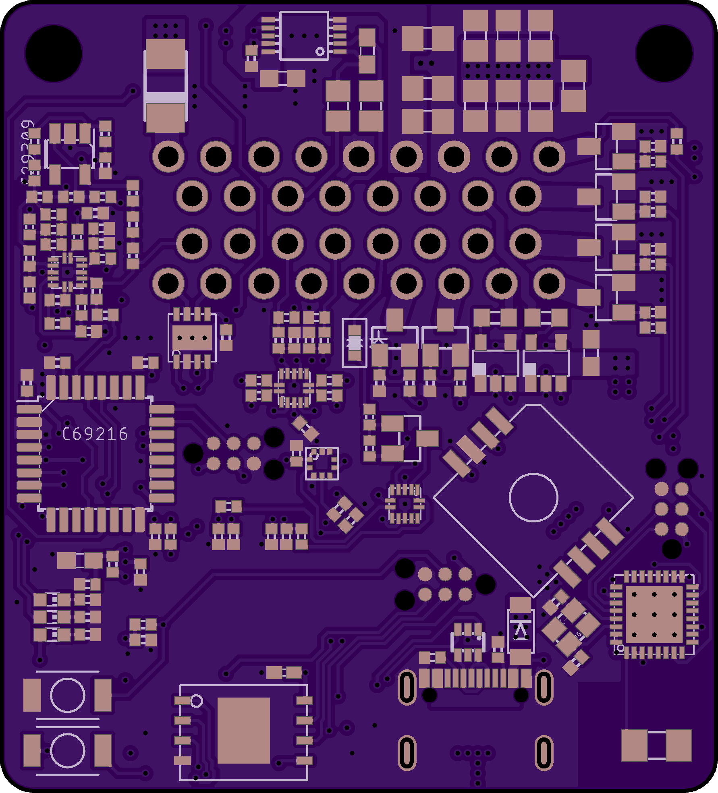
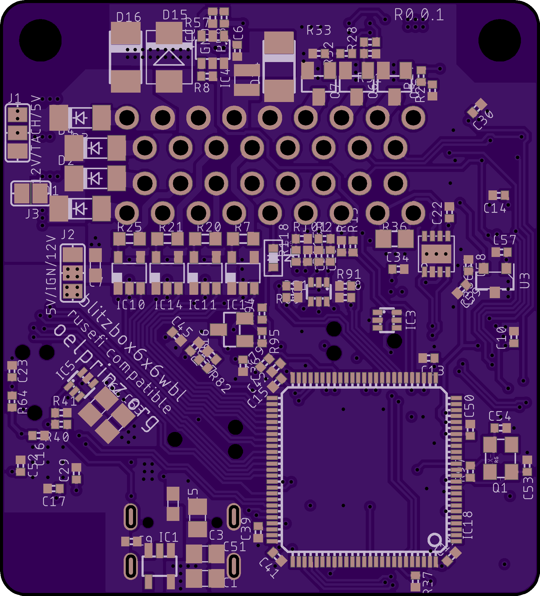

# blitzbox6x6wbl - first draft version 
blitzbox6x6wbl - low-cost and mini-sized 6x6 ECU for rusefi (and probably speeduino) firmware (45 x 50 mm) 
 

ultra-low-cost and mini-sized ECU for rusefi firmware (Rev0.0.1 45 x 50 mm) 
Integrated Wideband Lambda Controller with Bosch LSU 4.9 sonde 
4-Layer highly integrated design - hand soldering possible but only recommended to people with really experienced soldering skills.  Hardware is optimized for assembly by professional assembly manufacturer 
supports 6 cylinder full sequential 

6 high impedance injectors (Injector 5 and 6 shared with idle valve output) 
6 active ignition coils 
1 crankshaft sensor with MAX9924 VR-conditioner 
1 hall input for camshaft sensor 
6 analog inputs: CLT, IAT, TPS, Spare analog input, MAP or Baro onboard MPXH6400A 
1 digital input for disco swaggering (aka. launch control) 

1 fuel pump out 
2 idle valve out 
1 tacho out (5/12V) 
1 fan out 

USB-C programming interface onboard 
Wireless Tunerstudio connection WIFI/BT via ESP32-C5 

21.01.2026: Betaversion 0.0.1 first draft - More infos coming soon.... 

[Link to the rusefi project](https://www.rusefi.com "rusefi homepage") 
 
Quick link to Rev0.0.1 schematic: https://github.com/oelprinz-org/blitzbox6x6wbl/blob/master/hardware/Rev0.0.1/schematics_blitzbox6x6wbl.pdf  

### Bosch CJ125 (LQFP32 package) part numbers

|Bosch part number|
|:----------------|
|30615|
|40103|
|30522|

### Suitable Bosch lambda probes

Basically, the Bosch probes whose numbers start with **0 258 017** will fit, also Bosch **0 281 004**.  
Bosch numbers beginning with **0 258 007** are *LSU 4.2* probes and will not fit.

|Bosch number  |Length overall|Comment|
|--------------|--------------|-------|
|0 258 017 012 |1060mm||
|0 258 017 025 |1000mm|Bosch motorsport part|
|0 281 004 028 |540mm|common probe for diesel engines|
|0 258 017 029 |620mm|grey, used by BMW after 09/2006 (1178 7539124)|
|0 258 017 038 |340mm|grey, used by BMW (11787537984)|
|0 258 017 092 |950mm|black, used by BMW (1178 7540167)|
|0 258 017 126 |680mm|black, used by BMW after 09/2006 (1178 7561410)|
|0 281 004 150 |1215mm||
|0 281 004 184 |1000mm||
|...|||

### LSU4.9 probe pinout

|Pin#|Color|Description|Symbol|
|----|-----|--------|-----------|
|1|red|Pump current APE|IP|
|2|yellow|Virtual ground IPN|VM|
|3|white|Heater voltage H-|Uh-|
|4|grey|Heater voltaget H+|Uh+|
|5|green|Trim Resistor RT|IA|
|6|black|Nernst voltage UN|RE|

   
   
   
   
  
   
  
  
  
  
   
   

 

   

